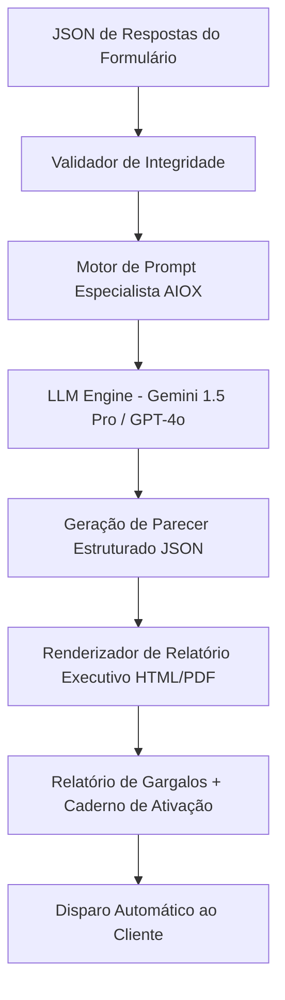

# Especificação Técnica — Diagnóstico Empresarial Automatizado (SaaS + IA)

> **Nome do Produto:** Diagnóstico Empresarial Express (SaaS)  
> **Precificação:** R$ 250,00 (parcelável em até 12x no cartão)  
> **Público-Alvo:** PMEs desassistidas e microempresários (faturamento R$ 50k a R$ 500k/mês)  
> **Objetivo do Produto:** Mitigar a *"miopia do negócio"*, identificar gargalos estruturais e gerar um Plano de Ação inicial sem custo de consultoria artesanal.

---

## 1. Arquitetura de Entrada (Formulário Inteligente)

O formulário é estruturado em 4 dimensões cardinais com perguntas ponderadas de 1 a 5 e campos abertos estratégicos:

```
                  ┌────────────────────────────────────────┐
                  │    FORMULÁRIO WEB / FLUXO CONVERSACIONAL│
                  └───────────────────┬────────────────────┘
                                      │
           ┌──────────────────────────┼──────────────────────────┐
           ▼                          ▼                          ▼
    1. FINANCEIRO              2. OPERAÇÕES &               3. PESSOAS &
       & DRE                      PROCESSOS                    LIDERANÇA
    - Apuração de Lucro        - Gargalos e Retrabalho      - Dores de Contratação
    - Mistura PF vs PJ         - Dependência do Dono        - Centralização Decisória
    - Margem e Markup          - Ferramentas e Sistemas     - Turn-over e Conflitos
                                      │
                                      ▼
                               4. VENDAS & MARKETING
                               - Previsibilidade de Receita
                               - CAC vs LTV / Canais Ativos
                               - Processo Comercial Definido
```

### Schema de Dados de Entrada (JSON)

```json
{
  "empresa": {
    "nome_fantasia": "Padaria & Empório Real",
    "segmento": "Varejo Alimentício",
    "tempo_mercado_anos": 4,
    "faturamento_medio_mensal": 180000,
    "numero_funcionarios": 14,
    "cidade_uf": "Goiânia-GO"
  },
  "scores_dimensoes": {
    "financeiro": {
      "mistura_pf_pj": true,
      "possui_dre_mensal": false,
      "clareza_margem_lucro": 2,
      "reserva_emergencia_meses": 1
    },
    "processos": {
      "dependencia_dono_operacao": 5,
      "processos_padronizados": 1,
      "nivel_retrabalho": 4
    },
    "pessoas": {
      "dificuldade_contratar": 5,
      "metodo_selecao_atual": "osmose_indicacao",
      "sobrecarga_lideranca": 4
    },
    "vendas": {
      "previsibilidade_vendas": 2,
      "dependencia_balcao_passivo": true,
      "canais_digitais_ativos": false
    }
  },
  "dor_prioritaria_declarada": "Trabalho 14 horas por dia e não vejo a cor do dinheiro sobrando no final do mês."
}
```

---

## 2. Pipeline de Processamento por Inteligência Artificial



---

## 3. Prompt de Sistema do Motor de Diagnóstico

```yaml
role: "Estrategista Chefe de Diagnóstico Empresarial PME"
objective: "Gerar relatório executivo de alta densidade técnica e extrema clareza para o pequeno empresário."
guidelines:
  - Tom: Sábio Socrático, direto, sem jargões corporativos vazios.
  - Estrutura de Saída:
      1. Índice de Saúde da Empresa (0 a 100).
      2. O Maior Ponto Cego (A Miopia do Negócio).
      3. Matriz de Gargalos por Eixo (Finanças, Processos, Pessoas, Vendas).
      4. Plano de Ação em 3 Passos Imediatos (Para o dono ou estagiário executar).
      5. Oferta do Próximo Passo: Apresentação do 'Júlio IA' (R$ 120/mês) para suporte diário ou Diagnóstico Aprofundado.
```

---

## 4. Entregáveis ao Cliente (Valor Percebido)

1. **Relatório Executivo de Diagnóstico (PDF / Web):** Diagnóstico visual com gráficos radar de maturidade e explicação clara da causa-raiz dos gargalos.
2. **Caderno de Ativação Inicial:** Guia passo a passo com modelos (Ex.: Planilha de DRE Simplificado, Roteiro de Contratação Básica).
3. **Ponte de Conversão para o Júlio IA:** Botão com 7 dias de degustação ou adesão imediata por R$ 120/mês.
