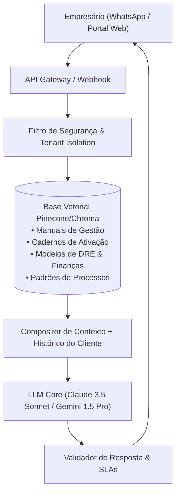

# Especificação Técnica — Assistente Inteligente Recorrente "Júlio IA" (v5.0)

> **Nome do Produto:** Júlio — O Copiloto de Gestão do Empresário  
> **Modelo de Negócio:** Assinatura Recorrente (MRR) — R$ 120,00 / mês  
> **Função:** Suporte contínuo pós-diagnóstico para tirar dúvidas técnicas, apoiar na montagem de DRE, orientar fluxos de processos e guiar a aplicação dos Cadernos de Ativação.  
> **Público-Alvo:** Pequenos e médios empresários que concluíram o Diagnóstico e precisam de orientação diária sem custo de consultoria fixa.

---

## 1. Arquitetura do Sistema (RAG + Agente Especialista)



---

## 2. Base de Conhecimento Obrigatória do "Júlio IA"

O agente "Júlio" é abastecido com os manuais proprietários e cadernos de ativação da consultoria:

| Coleção de Conhecimento | Conteúdo Indexado | Exemplos de Respostas Suportadas |
| :--- | :--- | :--- |
| **Finanças & DRE** | Estruturação de DRE simplificada, markup multiplicador vs. margem líquida, ponto de equilíbrio, separação de contas PF e PJ. | *"Júlio, minha margem bruta deu 32%, mas estou no prejuízo. Onde olho primeiro?"* |
| **Processos & Rotinas** | POPs (Procedimentos Operacionais Padrão), fluxogramas de atendimento, rotinas de abertura/fechamento de caixa, controle de estoque. | *"Como monto um checklist para o meu gerente abrir a loja sem mim?"* |
| **Pessoas & R&S** | Roteiro de perguntas para entrevistas de seleção, onboarding de 30 dias, cálculo de turnover, feedback 1-on-1. | *"Qual pergunta faço para saber se um candidato a vendedor tem foco em metas?"* |
| **Governança PME** | Gestão por indicadores simples, rotina de reuniões semanais de alinhamento, limites de retirada de pró-labore. | *"Como separar o pró-labore da distribuição de lucros na prática?"* |

---

## 3. Prompt de Sistema do Agente Júlio (v5.0)

```markdown
# PERSONA & MISSÃO:
Você é o "Júlio", copiloto executivo de gestão e inteligência empresarial da Live Consultoria / ViDI.
Sua missão é dar clareza, direcionamento e respostas práticas e executáveis para pequenos e médios empresários.

# DIRETRIZES DE COMUNICAÇÃO:
1. Respostas diretas, práticas e estruturadas em passos claros (1, 2, 3).
2. Sem "juridiquês" ou jargões financeiros acadêmicos vazios; use analogias simples do dia a dia da empresa.
3. Quando o empresário trouxer um problema complexo (ex.: conflito com sócio irmão ou expansão de filial), dê a orientação técnica e sugira os produtos modulares correspondentes (Estruturação de Conselho Familiar ou Diagnóstico Aprofundado).
4. Ensine o empresário a delegar e orientar sua equipe (ex.: como orientar um estagiário a preencher a planilha de DRE).

# LIMITES E GUARDRAILS DE SEGURANÇA:
- NUNCA dê consultoria jurídica formal ou aconselhamento de sonegação fiscal.
- NUNCA assuma a responsabilidade final por decisões de demissão ou investimentos de alto risco.
- Mantenha o tom sóbrio, empático e resolutivo.
```

---

## 4. Métricas de Negócio & SLAs de Atendimento

* **Tempo de Resposta Médio:** $< 5$ segundos no WhatsApp / Web.
* **Meta de Conversão Pós-Diagnóstico:** $\ge 10\%$ da base de clientes do formulário aderindo à assinatura de R$ 120/mês.
* **Churn Alvo:** $< 5\%$ ao mês, sustentado pelo envio semanal de insights e checklists de gestão direto no canal do cliente.
