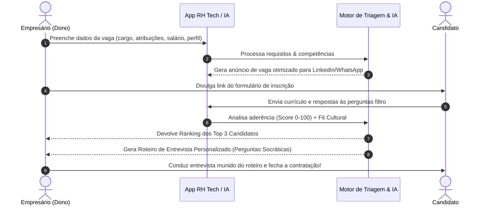

# Especificação Técnica — RH Tech: Recrutamento & Seleção Inteligente (DIY vs. Full Service)

> **Nome do Produto:** RH Tech Inteligente Live / ViDI  
> **Modelo DIY (Self-Service):** R$ 250,00 por processo seletivo  
> **Modelo Full-Service:** Cobrança equivalente a 1 (um) salário integral do candidato contratado  
> **Público-Alvo:** Pequenos e médios empresários sem equipe interna de RH que precisam contratar com precisão técnica e comportamental.

---

## 1. Problema de Mercado vs. Solução Inteligente

* **A Dor do Pequeno Empresário:** Contratação *"na tora, por osmose ou indicação de conhecidos"*, sem perguntas estruturadas, gerando turn-over elevado, passivo trabalhista e perda de tempo.
* **A Barreira das Consultorias de RH Tradicionais:** Cobram o primeiro salário do funcionário (R$ 2.000 a R$ 6.000+), inviabilizando seleções contínuas de PMEs.
* **A Oportunidade:** O próprio empresário prefere conduzir a entrevista, desde que munido de uma ferramenta de IA que forneça as perguntas técnicas e o roteiro comportamental exato.

---

## 2. Fluxo da Ferramenta RH Tech DIY (R$ 250)

---

## 3. Módulos do Sistema de RH Tech

### Módulo A — Gerador de Job Description de Alta Conversão
* Transforma descrições genéricas em anúncios atraentes com foco nas responsabilidades reais e cultura da empresa.

### Módulo B — Triador de Currículos e Score de Aderência
* Analisa arquivos em PDF/DOCX comparando experiências prévias com as competências exigidas pela vaga.
* Identifica *red flags* (inconsistências de datas, falta de requisitos mandatórios).

### Módulo C — Roteiro de Entrevista Socrática para o Dono
* O grande diferencial do produto: gera uma lista de **5 a 8 perguntas situacionais e comportamentais personalizadas para cada candidato**:
  * *Exemplo de Pergunta:* "Você declarou experiência em conciliação bancária. Qual foi a maior discrepância que encontrou em um fechamento de caixa e como solucionou?"
  * *O que o dono deve observar na resposta:* Guia explicativo de respostas satisfatórias vs. insatisfatórias.

---

## 4. Comparativo de Modelos: DIY (R$ 250) vs. Full Service (1 Salário)

| Funcionalidade / Escopo | Versão DIY (R$ 250) | Versão Full Service (1º Salário) |
| :--- | :--- | :--- |
| **Geração de Anúncio Inteligente** | ✅ Automático via IA | ✅ Automático com revisão de especialista |
| **Triagem de Currículos** | ✅ Score automatizado | ✅ Triagem humana sênior + IA |
| **Roteiro de Entrevista** | ✅ Entregue ao dono para conduzir | ✅ Conduzido pela consultoria |
| **Parecer Final de Aprovação** | ❌ Avaliação pelo próprio empresário | ✅ Emissão de Parecer Elite V6.0 |
| **Garantia de Reposição (30 dias)** | ❌ Não se aplica | ✅ Reposição inclusa sem custo adicional |
